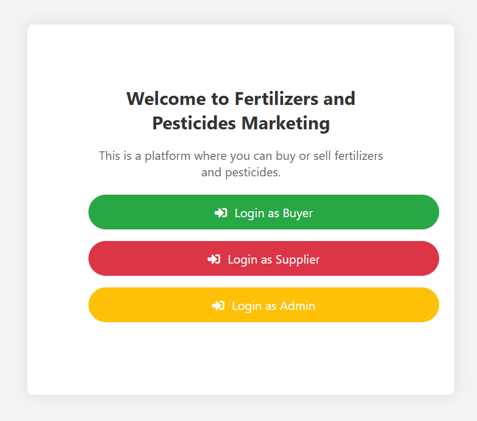

# Agriculture Booking System



## Overview

The Agriculture Booking System is a web-based platform that connects buyers and sellers of fertilizers. Sellers can list fertilizers, while buyers can browse and purchase according to their needs. An admin oversees and manages the platform. The system is built using HTML, CSS, JavaScript, and PHP, with XAMPP as the required local server environment.

UNzip agriculture booking.zip

## Features

### Admin Features:

- Secure login and authentication
- Manage users (buyers and sellers)
- Approve or remove fertilizer listings
- Monitor transactions

### Seller Features:

- Register and log in to the platform
- Post fertilizer products with details
- Manage their listings (edit/delete)

### Buyer Features:

- Register and log in to the platform
- Browse available fertilizers
- Purchase fertilizers from listed sellers
- View purchase history

## Technology Stack

- **Frontend:** HTML, CSS, JavaScript
- **Backend:** PHP
- **Database:** MySQL (via XAMPP)
- **Server:** Apache (via XAMPP)

## Installation and Setup

### Prerequisites:

1. Install **XAMPP** from [Apache Friends](https://www.apachefriends.org/)
2. Start **Apache** and **MySQL** from the XAMPP Control Panel

### Steps:

1. Download and extract the project files into the `htdocs` folder of XAMPP.
2. Open **phpMyAdmin** ([http://localhost/phpmyadmin/](http://localhost/phpmyadmin/))
3. Create a database named `agriculture_booking`.
4. Import the provided `database.sql` file into the newly created database.
5. Configure database credentials in `config.php`:
   ```php
   <?php
   $servername = "localhost";
   $username = "root";
   $password = "";
   $dbname = "agriculture_booking";
   ?>
   ```
6. Open the browser and navigate to `http://localhost/agriculture_booking/`

   &#x20;

  #dummy entires which exists
   supplier usernm zack&#x20;

   ps 123

   buyer usernm zack

   ps 123

   admin usrnm admin

   ps 123

   Usage

### Admin:

1. Log in using admin credentials.
2. Approve and manage fertilizer listings.
3. Oversee user transactions.

### Seller:

1. Register and log in.
2. List fertilizers with details.
3. Manage their listings.

### Buyer:

1. Register and log in.
2. Browse available fertilizers.
3. Purchase required fertilizers.
4. View purchase history.

## Folder Structure

```
/agriculture_booking
|-- index.php
|-- login.php
|-- register.php
|-- dashboard.php
|-- admin/
|   |-- manage_users.php
|   |-- approve_fertilizers.php
|-- seller/
|   |-- add_fertilizer.php
|   |-- manage_listings.php
|-- buyer/
|   |-- browse_fertilizers.php
|   |-- purchase_history.php
|-- assets/
|   |-- css/
|   |-- js/
|-- database.sql
|-- config.php
```

## Future Enhancements

- Implement order tracking for buyers.
- Add payment gateway integration.
- Improve UI/UX for better user experience.

## License

This project is open-source and available for modification and distribution.

